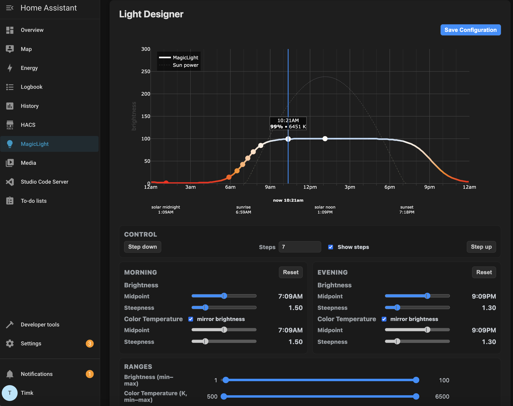

# MagicLight - Adaptive Lighting for Home Assistant

Transform your home's ambiance with MagicLight, the intelligent lighting system that automatically adjusts your lights throughout the day to match natural sunlight patterns.

## ✨ Features

- **Automatic Adaptive Lighting** - Seamlessly transitions from cool daylight to warm evening tones
- **Smart Switch Integration** - Works with your existing switches for instant control
- **Customizable Light Curves** - Fine-tune brightness and color temperature to your preferences
- **Multi-Protocol Support** - Controls ZigBee, Z-Wave, WiFi, and Matter lights
- **Visual Light Designer** - Interactive web interface to perfect your lighting curves
- **Magic Mode** - Automatically updates lights when you use physical switches
- **Energy Efficient** - Optimized group control for ZigBee networks

## 🎯 Why MagicLight?

Traditional smart lights require constant manual adjustments or complex automations. MagicLight changes that by providing intelligent, adaptive lighting that just works. Your lights automatically adjust based on the sun's position, creating the perfect ambiance for any time of day.

- **Better Sleep** - Reduces blue light exposure in the evening
- **Increased Comfort** - Natural light transitions that feel right
- **Zero Maintenance** - Set it once and forget it
- **Works with What You Have** - Compatible with all major smart light protocols

## 📦 Installation

> **⚠️ IMPORTANT**: MagicLight requires BOTH components to be installed for full functionality:
> 1. **The Add-on** - Provides the adaptive lighting engine and Light Designer interface
> 2. **The Integration** - Enables MagicLight services for automations and blueprints
>
> Installing only one component will result in limited or non-functional features.

### Step 1: Install the Home Assistant Add-on (Required)

1. Click the button above to add the MagicLight repository to your Home Assistant
2. Navigate to **Settings** → **Add-ons** → **Add-on Store**
3. Find "MagicLight Adaptive Lighting" and click Install
4. Start the add-on and check the logs

### Step 2: Install the HACS Integration (Required)

1. Ensure [HACS](https://hacs.xyz/) is installed
2. Click the button above or search for "MagicLight" in HACS
3. Click Install and restart Home Assistant
4. Add MagicLight through **Settings** → **Devices & Services**

### Step 3: Import the Blueprint (Recommended)

1. Click the button above to import the MagicLight Smart Switch Control blueprint
2. Or manually import from: **Settings** → **Automations & Scenes** → **Blueprints** → **Import Blueprint**
3. Use URL: `https://github.com/intuitivelight/homeglo-ha/blob/main/custom_components/magiclight/blueprints/hue_dimmer_switch.yaml`
4. Create an automation from the blueprint:
   - Select your switch device(s) (supports ZHA and Hue Bridge)
   - Choose target area(s) to control
   - Save and activate the automation

The blueprint provides smart button mappings:
- **ON button**: Smart toggle (turns lights on with MagicLight or off)
- **OFF button**: Reset to current time and enable MagicLight
- **UP/DOWN buttons**: Step brightness along the adaptive curve

## 🚀 Quick Start

1. **Install ALL components** following the installation steps above
2. **Create an automation** from the blueprint for your switch devices
3. **Press your configured switch** - lights in that area will automatically adjust
4. **Open Light Designer** from the Home Assistant sidebar to customize your preferences
5. **Enjoy** perfect lighting throughout the day!

## 📊 Light Designer

Access the Light Designer through your Home Assistant sidebar when the add-on is running. This intuitive interface lets you:

- Preview your lighting curves in real-time
- Adjust brightness and color temperature ranges
- Fine-tune morning and evening transitions
- Save configurations instantly

## 🔧 Compatibility

MagicLight works with:
- **Smart Switches**: ZHA-compatible switches (Hue, IKEA, Aqara, etc.)
- **Smart Lights**: ZigBee, Z-Wave, WiFi (Tuya, LIFX, etc.), Matter
- **Home Assistant**: 2023.1 or newer

## 📝 Configuration

MagicLight works out of the box with sensible defaults. For advanced users, customize through:

- **Add-on Configuration**: Adjust color modes and temperature ranges
- **Light Designer**: Visual interface for curve customization
- **YAML**: Advanced automation possibilities

## 📄 License

HomeGlo is released under the GNU General Public License v3.0. See [LICENSE](LICENSE) for details.

---

**Need Help?** Open an [issue](https://github.com/intuitivelight/homeglo-ha/issues) or check our [documentation](https://github.com/intuitivelight/homeglo-ha/wiki).

**Love HomeGlo?** Give us a ⭐ on GitHub!
